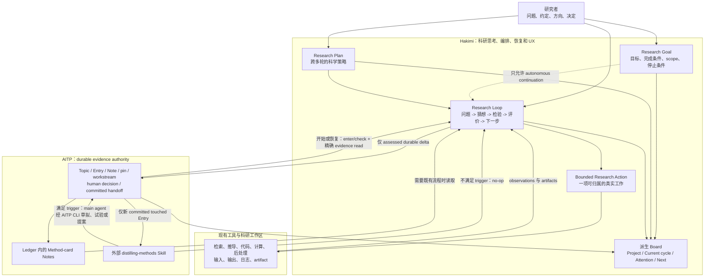
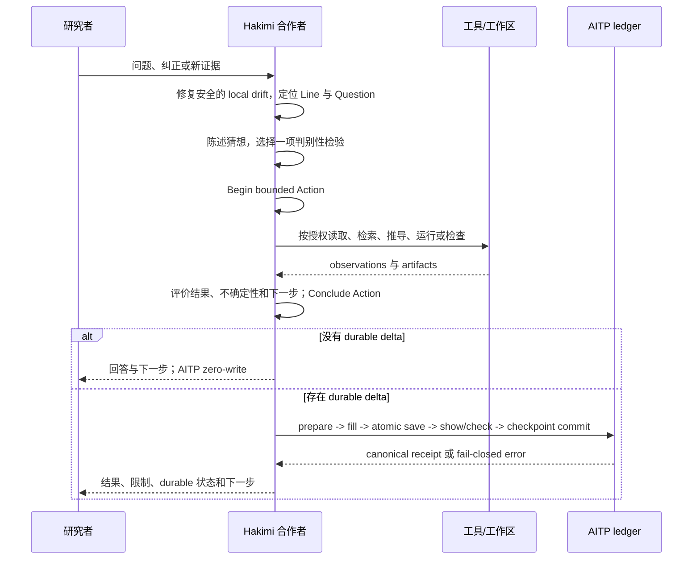
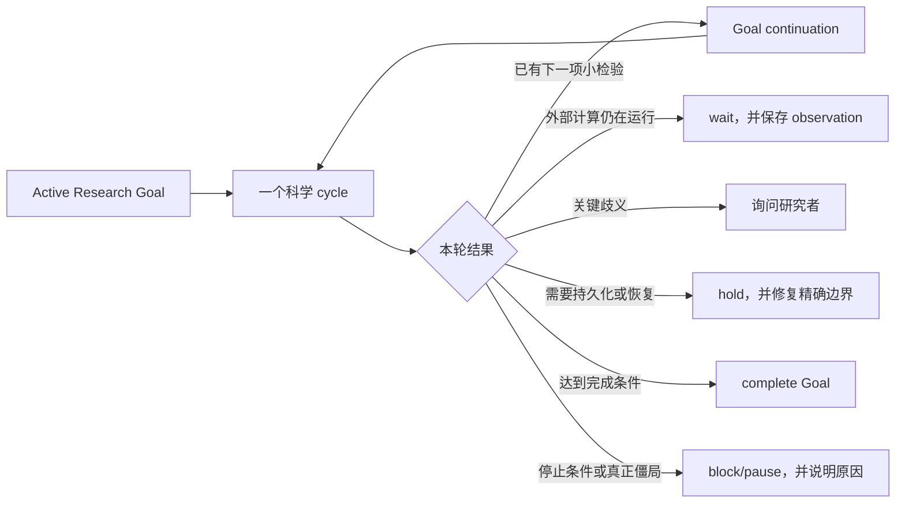
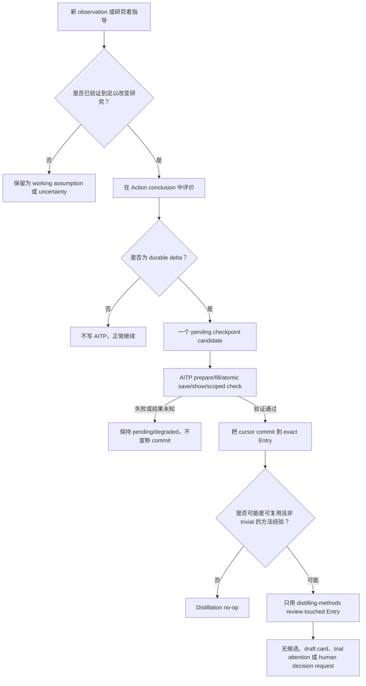

# 理论物理 Research Mode：合作者模型、实现审计与分阶段规划

> 状态：指导性设计与实现审计，2026-09-04。
>
> 本文描述期望的科研体验，对照当前 Hakimi × AITP 实现和真实会话证据，
> 并把后续工作拆成有限阶段。它不是 AITP canonical Entry/Note，不授权新的
> AITP schema 或 CLI，也不是任何科学结论的证据。当前代码、实时 CLI help、
> versioned contract、fixtures 和 tests 始终是事实来源。

## 1. 总体判断

Hakimi 应该像一位谨慎、主动、能共同推理的理论物理合作者，而不是要求研究者
操作状态机的 workflow 表单。合适的架构分三层：

1. **科学认知闭环**：从问题或猜想出发，选择最小的判别性检验，评价证据，
   再决定下一步；
2. **轻薄的执行外壳**：把真实工具工作归属于一个有界 Action，并维持恢复、权限、
   幂等和 provenance 不变量；
3. **AITP durable boundary**：只保存值得跨 session 依赖的证据和决定，然后条件性
   review 是否存在可复用方法。

内部可以保留 phase 和 revision 来保证 replay 安全，但它们不能成为用户的主要
心智模型、Board 的主叙事，或 Agent 每经过一个记账边界就停下来的理由。

当前实现有相当好的基础，但还没有端到端达到这个体验：

- 当前 Research Loop coordinator 主要是 turn-boundary hook，不是完整的
  “猜想—检验—评价—再规划”闭环；
- Action conclude 后固定落到 `state_updated`，而下一项 Action 不能从这里直接
  begin，需要模型额外操作 phase；
- `BeginResearchAction` 被拒绝后，main agent 仍可通过通用工具继续做新的科研；
- alert reconciliation 的重复 op 和过量 status injection 会抢走本应留给物理问题的
  注意力；
- Research Plan v2 适合 Goal 驱动的多阶段工作，但强制要求 Goal 和 Program alignment，
  对没有 Goal 的交互式探索过于僵硬；
- 四槽 Board 是正确方向，但它仍在投影一个可能 stale、重复或 scope 不一致的底层状态。

因此，历史 [S0–S10 program](unified-research-mode-program.md) 的 “complete” 应解释为：
有限 implementation slices 及其 deterministic gates 已关闭；它不等于“理论物理合作者
行为”和真实 session UX 已经通过经验验收。

## 2. 优秀理论物理合作者应当做什么

每个有意义的科研 cycle 都应能用自然的科学语言回答五个问题：

1. **我们究竟想弄清什么？** 一个聚焦的未知、主张或猜想。
2. **什么能区分当前仍成立的可能性？** 一个有停止条件的推导、文献检查、代码审计、
   计算或对照。
3. **实际观察到了什么？** 输入、约定、命令、输出、来源、失败和不确定性，而不只是
   “调用了工具”。
4. **什么因此改变了？** 哪个猜想、置信度、计划或适用边界改变；哪些结论仍不成立。
5. **最小且有用的下一步是什么？** 继续、修改猜想、询问、等待、持久化或停止。

一个可靠合作者还应当：

- 在能改变决策时主动检查隐藏假设和 falsifier；
- 明确物理 convention、近似区间、单位和数值收敛边界；
- 区分 scheduler event、程序正常退出和科学结果；
- 把研究者指导保留为有 provenance 的输入，而不是自动升级为已验证事实；
- collaborative 模式只追问真正影响计划的歧义；
- dreaming 模式可以采用可逆、低成本、scope 内的假设，但要让研究者能看到和纠正；
- 保存重要失败和稳定 workaround，又不把每行日志都变成知识；
- 在证据、权限、成本或协议能力不足时诚实停止。

正常科研过程中，研究者不应被迫理解 `state_updated`、revision token、alert fingerprint、
checkpoint ID 或 transition table。这些信息应留在 diagnostics 和精确恢复命令里。

## 3. 职责与概念模型



| 对象 | 含义 | Authority | 关键边界 |
| --- | --- | --- | --- |
| AITP Topic / Program | 长期科学课题及其顶层 Research goal | AITP，Hakimi 只读观测 | Hakimi 不改写，也不靠文本相似度导入为本地事实 |
| Research Goal | 面向用户的 objective、completion criterion、scope、non-goals、stop conditions 和 progress | Hakimi 对 generic Goal engine 的特化投影 | 仍只有一个 Goal engine 拥有 continuation、budget 和 lifecycle |
| Research Plan | 跨多个科研 cycle 的人可读策略 | Hakimi | 指导科研，不是 scheduler，也不是 AITP record |
| Research Line | 当前 session 内一条连贯的研究线 | Hakimi | 可保存多条 Line，但前台只有一个 active Action |
| Question | Line 内可回答或可证伪的未知 | Hakimi | 可 reopen、拆分、blocked 或 abandoned |
| Hypothesis | 当前候选解释或预期结果 | 科研 working state | 目前散落在 Question/Plan/assessment 文本中，尚非独立 contract |
| Action Plan | 下一项 bounded Action 的短 TODO | Hakimi local Plan | 不重复跨 cycle 的 Research Plan |
| Research Action | 一项真实科研工作的 attribution envelope | Hakimi | Begin → work → conclude；不是每个 tool call 一个 Action |
| Run observation | 对外部进程或计算目前知道什么 | Hakimi working state；durable 时再 pin 证据 | RUNNING/COMPLETED 不等于物理成功 |
| Checkpoint | assessed local progress 到一个 AITP Entry 的候选桥梁 | Hakimi + AITP receipt/canonical verification | pending/committed 不得猜测或静默回退 |
| Entry / Note / Method card / trial | durable evidence、综合或复用流程 | AITP | 只由 AITP CLI/files contract 和外部 Skills 定义语义 |
| Board | 给研究者看的紧凑派生视图 | authoritative state 的 projection | 绝不成为第二个数据库或竞争 status model |

Generic Goal engine 应继续作为内部基础设施。“Research Goal”是它在理论物理场景下的
特化 contract 和公开投影，而不是第二个 Goal engine。没有 Goal 时可以进行 interactive
Research；只有需要跨 turn 自动 continuation 或宣告 Goal complete 时才必须有 Goal。

### 3.1 最终效果：对话、Hakimi 状态和 AITP 文件分别承载什么

最终系统里，同一件科研工作会有三种不同寿命的信息，不能混为一谈：

| 层次 | 研究者实际看到什么 | 保存在哪里 | 何时更新 |
| --- | --- | --- | --- |
| 对话与 Compact Board | 当前课题进度、正在检验的猜想、本轮 finding/限制、一个 attention 和一个 next step | Board 不单独持久化；由 Hakimi snapshot 实时派生 | 每次 working state、Action conclusion、AITP commit/recovery 后 |
| Hakimi working state | Goal、Plan、Line、Question、Focus、Action、Run observation、pending checkpoint、gate、内部 revision | Hakimi checkpointed wire models；committed cursor/history 作为不可随 conversation undo 回退的 external fact | 每个本地科研 mutation；安全 reconciliation 可在回答前修复派生 drift |
| 科研 artifact | 输入、输出、日志、脚本、代码、图表、remote pointer manifest | 用户现有 repository/workspace/remote system | 由实际工具产生；Hakimi 只记录 observation，不把位置当作证据本身 |
| AITP canonical state | 跨 session 可信赖的 Entry、Note、refs/pins、relations、workstream membership、human decisions 和 handoff | 科研 workspace 的 `.aitp/STORE.toml`、`.aitp/topic/TOPIC.md`、`.aitp/topic/entries/`、`.aitp/topic/notes/` | 仅 durable delta 经 prepare/save/show/check 验证后 |
| 可复用方法 | Method-card theory Note、basis refs、exact-card trials、approval/publication decisions | 仍在 AITP canonical files；语义由外部 `distilling-methods` Skill 管理 | 仅 committed touched evidence 满足既有 trigger，且所需 human gates 完成后 |

因此最终用户体验不是“Board、Research status、AITP status 各说一套话”，而是：

```text
Hakimi working state 负责“现在正在想和做什么”
AITP committed state 负责“以后可以依赖什么”
Board 只把两者当前最重要的差异翻译给研究者
```

一个尚未 commit 的好结果可以立即出现在 Board 的 `Finding`，但必须标为 working/pending；
只有 AITP commit 成功后，才能显示为 durable。反过来，AITP 中其他 Line 的历史问题仍存在，
但它们不应抢占当前 Line 的 compact attention。

### 3.2 一次完整 Research turn 的责任链

| 顺序 | 实际发生的事 | Owner | 主要输入 | 主要输出或副作用 |
| --- | --- | --- | --- | --- |
| 0. Admit | 判断本 turn 是 interactive Research，还是 Goal-owned continuation | Hakimi Research admission | mode、main-agent identity、typed turn intent、Goal continuation decision | 一次 transient Research turn lease；不写 AITP |
| 1. Reconcile | 修复可证明的 local drift，清除重复派生状态 | Hakimi Research service | checkpointed state + non-rewinding cursor/history | coherent local snapshot；不推断科学结论或 human authority |
| 2. Orient | 在 mode entry/restore 或需要维护时读取 Topic、scoped handoff、check 和相关 evidence/cards | Hakimi Session AITP coordinator + AITP CLI | explicit current Line→workstream binding | 只读 maintenance receipt 与可核验上下文；exit 2 则 degraded/fail closed |
| 3. Think/Plan | 明确 current Question、猜想、falsifier、milestone 和最小检验 | Main research agent，受 Research Plan/policy 指导 | 用户信息、working state、AITP evidence、适用 cards | 一个可解释的 bounded next action；未必写任何状态 |
| 4. Begin | 为需要工具的真实科研工作建立 Action envelope | Hakimi Research service | purpose、expected evidence、stop condition、scope/capabilities、fresh bindings | active Action；用户通常不需要操作 phase |
| 5. Execute | 读取、检索、推导、修改、运行或收集结果 | Existing Hakimi tools/workspace | active Action capability + 普通 permission/cost policy | artifacts 和 observations；未来由 Tool Executor 硬性校验 ownership |
| 6. Evaluate/Conclude | 对照猜想解释证据、反证、限制和 next step，并且只做一次 durability assessment | Main research agent + Hakimi Research service | Action outputs 与原 completion/stop condition | completed/abandoned Action、一次 progress、`no_durable_delta` 或一个 pending candidate |
| 7. Persist | 对 durable candidate 执行 prepare/fill/atomic save/show/scoped check/commit | Hakimi durable commit + Session adapter；AITP CLI 拥有 canonical write | exact Topic、exact singleton workstream、draft、refs、idempotency key | canonical Entry + receipt + committed cursor；失败保持 pending/degraded |
| 8. Distill | 只 review 新 committed touched Entry 是否含可复用方法经验 | Hakimi 只负责 handoff；外部 `distilling-methods` Skill 负责语义 | committed Entry、已有 card/basis/trials | no-op、agent-draft card、trial attention 或 human decision proposal；不自动 approve/publish |
| 9. Project | 将 Goal、Plan、current cycle、AITP durability 和一个 actionable issue 投影给人 | Hakimi shared Research projection + TUI/Web | authoritative Hakimi state + validated AITP receipt | 四槽 Board 和按需展开 diagnostics；Board 自身零写入 |
| 10. Continue | 决定结束本 turn、等待、询问、hold、继续下一 cycle 或 complete | Generic Goal engine 是唯一 continuation owner | Goal status、completion、budget、wait/gate/persistence guards | 无 Goal 则返回用户；有 Goal 且放行则 enqueue 下一 turn |

关键点是：AITP 不是第 3–6 步中的思考器，也不是每一步都必须写的日志。它在第 2 步提供
可靠起点，在第 7 步接收可靠增量，在第 8 步为复用知识提供证据基础。

### 3.3 实际代码和协议放在哪里

以下是当前真实 owner，以及后续修改应该落在哪里。路径均相对各自仓库根目录。

- Hakimi 根目录：`/home/bhjia/physics/repo/hakimi`
- AITP 根目录：`/home/bhjia/physics/repo/AITP-Research-Protocol`
- 实际科研项目：各自 workspace；例如 GW/LibRPA 的 canonical records 位于其自己的
  `.aitp/`，不在 Hakimi 或 AITP 源码仓库中。

#### Hakimi repository

| 职责 | 当前主要位置 | 应承担的最终职责 |
| --- | --- | --- |
| Research feature 组装与 scope | [`packages/agent-core-v2/src/features/aitpResearch/aitpResearchFeature.ts`](../../packages/agent-core-v2/src/features/aitpResearch/aitpResearchFeature.ts) | 按 `App → Session → Agent` 装配服务；不把 session/agent 状态塞进全局对象 |
| Turn admission | [`researchTurnAdmission.ts`](../../packages/agent-core-v2/src/features/aitpResearch/loop/researchTurnAdmission.ts) | 只签发 interactive/autonomous transient lease；不执行科研、不拥有 continuation |
| Research cycle boundary | [`researchLoopCoordinator.ts`](../../packages/agent-core-v2/src/features/aitpResearch/loop/researchLoopCoordinator.ts) | turn 前 reconcile/orient，turn 后触发必要 scoped maintenance；不判断科学结论、不调度第二个 loop |
| Research working state、Action、gate、reconciliation | [`agentResearchService.ts`](../../packages/agent-core-v2/src/features/aitpResearch/research/agentResearchService.ts) 与 [`aitpResearchOps.ts`](../../packages/agent-core-v2/src/features/aitpResearch/aitpResearchOps.ts) | 保存/重放 local Research model，机械修复 safe drift，Begin/Conclude Action；不写 canonical `.aitp` |
| 内部 transition invariants | [`researchTransitionAuthority.ts`](../../packages/agent-core-v2/src/features/research/transitions/researchTransitionAuthority.ts) | 保证 replay/mutation 合法；不成为用户要手动操作的科研流程 |
| Research Plan v2 | [`researchPlanV2Ops.ts`](../../packages/agent-core-v2/src/features/aitpResearch/researchPlanV2Ops.ts) 及 Research tools/service | 跨 cycle strategy；interactive draft 与 autonomous activation 使用不同强度的绑定 |
| Goal lifecycle/continuation | [`goalService.ts`](../../packages/agent-core-v2/src/agent/goal/goalService.ts) | 唯一拥有跨 turn continuation、budget、pause/resume/complete；Research 只能 allow/hold/abstain |
| 通用工具执行与未来 hard ownership | [`toolExecutorService.ts`](../../packages/agent-core-v2/src/agent/toolExecutor/toolExecutorService.ts) + Research-owned `onBeforeExecuteTool` policy | 所有模型 tool call 的统一执行点；Research domain 在这里 veto 无 Action/无 lease/越 capability 的工作，不把该 policy 混进 risk permission chain |
| AITP process/contract adapter | [`sessionAitpAdapterService.ts`](../../packages/agent-core-v2/src/features/aitpResearch/adapter/sessionAitpAdapterService.ts) | 发现并调用外部 CLI，严格解析 versioned contract；不复制 AITP parser/validator |
| Read-only lifecycle maintenance | [`sessionAitpLifecycleCoordinatorService.ts`](../../packages/agent-core-v2/src/features/aitpResearch/coordinator/sessionAitpLifecycleCoordinatorService.ts) | Session-scope single-flight `enter → check`，只对 exact bound workstream 形成 receipt |
| Durable commit barrier | [`durableCommitService.ts`](../../packages/agent-core-v2/src/features/aitpResearch/research/durableCommitService.ts) | 编排 prepare/save/show/check/commit，验证 Topic/workstream/revision/receipt/幂等；科学内容仍由 main agent 判断 |
| Distillation handoff | [`distillationHandoffService.ts`](../../packages/agent-core-v2/src/features/aitpResearch/research/distillationHandoffService.ts) | 新 commit 后只把 touched Entry 交给外部 Skill；不拥有 trigger/card/trial/decision 语义 |
| Model context | [`researchInjectionPresenter.ts`](../../packages/agent-core-v2/src/features/aitpResearch/injection/researchInjectionPresenter.ts) | 只注入 current Goal/Question/hypothesis-or-gap/effective next 与新变化约束；背景按需读取 |
| Public wire contract | [`packages/protocol/src/research.ts`](../../packages/protocol/src/research.ts)、[`packages/kap-server/src/protocol/research.ts`](../../packages/kap-server/src/protocol/research.ts)、[`packages/kap-server/src/routes/research.ts`](../../packages/kap-server/src/routes/research.ts)、[`packages/klient/src/contract/agent/research.ts`](../../packages/klient/src/contract/agent/research.ts)、[`researchSchemas.ts`](../../packages/klient/src/contract/agent/researchSchemas.ts)、[`packages/node-sdk/src/sdk-rpc-client-v2.ts`](../../packages/node-sdk/src/sdk-rpc-client-v2.ts) | REST/WS/SDK/klient 使用同一 versioned snapshot、command 和 revision semantics |
| TUI Board/Manager | [`research-board.ts`](../../apps/kimi-code/src/tui/components/chrome/research-board.ts)、[`research-manager.ts`](../../apps/kimi-code/src/tui/components/dialogs/research-manager.ts) | 消费 shared projection；compact view 只显示 Project/Current cycle/Attention/Next，Manager 提供精确 recovery/control |
| Web Board/Manager | [`researchBoardPresentation.ts`](../../apps/kimi-web/src/lib/researchBoardPresentation.ts)、[`ResearchBoard.vue`](https://github.com/bhjia-phys/Hakimi/blob/main/apps/kimi-web/src/components/chat/ResearchBoard.vue)、[`ResearchManagerDialog.vue`](https://github.com/bhjia-phys/Hakimi/blob/main/apps/kimi-web/src/components/dialogs/ResearchManagerDialog.vue) | 与 TUI 同值同语义；REST hydration 不覆盖更新的 WS revision；不建立 Web-only Board state |

#### AITP-Research-Protocol repository 与科研 workspace

| 职责 | 当前主要位置 | 最终职责 |
| --- | --- | --- |
| Canonical CLI entry | `plugins/aitp-research-protocol/scripts/aitp.py` | 唯一公开命令入口；Hakimi 通过 argv 调用，不要求全局安装 |
| Canonical parser/validator/runtime | `plugins/aitp-research-protocol/scripts/vendor/aitp/` | deterministic I/O、validation、projection 和 compare-and-save；不负责科学推理或 Goal continuation |
| Machine-readable adapter contract | `plugins/aitp-research-protocol/aitp.contract.json` | 冻结 commands、flags、schemas、Skill paths 和兼容版本；未知 contract 时 Hakimi fail closed |
| Session research discipline | `plugins/aitp-research-protocol/skills/using-aitp/SKILL.md` | enter/check、evidence review、durable record/note、session-boundary maintenance；Hakimi native coordinator 存在时由它调度，Skill 是 best-effort fallback，不是 runtime exactly-once hook |
| Method-card semantics | `plugins/aitp-research-protocol/skills/distilling-methods/SKILL.md` | 唯一拥有 trigger、basis、exact trial、revision、两步 human decision 和 publication 规则 |
| 双方 handoff | `docs/hakimi/README.md` 与 `docs/hakimi/compatibility-matrix.md` | 同步当前已发布 CLI/schema/contract、限制与 planned/unavailable；不以旧 roadmap 覆盖 live facts |
| 科研项目 canonical store | workspace 内 `.aitp/STORE.toml`、`.aitp/topic/TOPIC.md`、`entries/`、`notes/` | 保存 Topic、Entry、Note 和显式 workstream membership；只能经当前 AITP CLI/files contract 写入，Hakimi 不直接编辑 canonical files |
| Local draft/config | workspace 内 `.aitp/local/` | prepare draft 和 local policy/config；不是 canonical evidence，不能被 Board 当作 committed result |

#### 研究者与实际工具

| Owner | 负责什么 | 不负责什么 |
| --- | --- | --- |
| 研究者 | 研究方向、物理 convention、昂贵/不可逆动作、Goal–Program 与 Line–workstream 语义确认、最终科学判断、card approval/publication | 不负责手动维护 phase、清理可机械修复的 warning、替 Agent 填日常 AITP 状态 |
| Main research agent | 猜想、最小检验、证据评价、durability 与方法候选判断、Plan 更新、AITP draft 内容和下一步 | 不冒充 human authority，不把 scheduler success 当物理结论 |
| Existing tools/workspace | 执行 ABACUS/LibRPA、shell、代码、搜索、后处理并产生真实 artifact | 不拥有 ledger、Research Goal、科学结论或 method-card 决策 |
| Subagent/specialist | 在 bounded task 内返回 literature/derivation/numerical/code evidence packet | 不推进主 Research state、不写 AITP、不询问/代答 human decision |

### 3.4 最终你会实际看到什么

例如你说：“继续检查 r30，先确认修复后第一轮 QSGW 是否还发散。”正常前台不应展示整份
状态机，而是类似：

```text
Research · qsgw-headwing · Goal active / running

Project
  Si k666 head-wing OFF/ON 三轮验证 · M2/4：最小 ON diagnostic

Current cycle
  Hypothesis: 显式 WFC convention 可消除 refresh flag 泄漏导致的异常 Delta H
  Test: 验收 r30 clean binary，并只运行第一轮 ON diagnostic
  Finding: r30 build 尚在运行；本轮没有新的物理结论

Attention
  Waiting for job 3209557; this is an external wait, not a scientific failure.

Next
  作业终态后检查 binary hash、CTest、RPATH 和 regression；通过才提交 ON diagnostic
```

只有点开 diagnostics/manager 时，才显示 action ID、checkpoint ID、revision、receipt、
完整 alerts 和恢复命令。后台责任链则是：

```text
回答前 reconcile safe local drift
→ 必要时通过 AITP enter/check 读取当前显式 workstream
→ 建立“监控并验收 r30”这一项 bounded Action
→ 查询作业与读取输出
→ Conclude：等待中 / 失败 / 已通过，并评价证据边界
→ 若只有 transient observation：AITP zero-write
→ 若形成 durable run result：经 AITP CLI 提交 Entry 并核验 receipt
→ 只对新 committed Entry 做一次条件性 method review
→ 重新派生 Board
→ Goal engine 决定 wait、hold 或自动进入下一项检验
```

研究者在这个例子里只需要处理真正的选择，例如是否改变物理 convention、是否接受昂贵的
下一轮计算、Goal 与 Program 是否确属同一研究关系，或是否批准/发布 Method card。历史
checkpoint 清理、重复 alert、phase drift 和 Board 刷新属于 Hakimi 的机械维护，不应反复问人。

## 4. 正常 Research Mode 的科研顺序

### 4.1 没有 Goal 的交互式 Research

自然讨论应保持自然。如果只是解释概念、澄清问题或比较思路，而且不需要调用科研工具、
形成 durable claim，就不必制造 Action。当需要真实的 evidence-producing work 时，
harness 应在同一 user turn 内透明地建立、执行并关闭一个 bounded Action。



没有 Goal 时，回答结束后本 turn 就结束。Research Mode 仍保持可用，但不会自动 enqueue
下一轮。

### 4.2 有 active Goal 的 Research

科学 cycle 本身完全相同。唯一差别是：cycle 到达安全边界后，generic Goal engine 可以
请求下一 turn。



Goal 为 `active` 不表示此刻一定在执行。科学目标状态与 continuation 状态必须分开显示：

- `active · running/queued`：下一项 Goal-owned turn 正在执行或等待执行；
- `active · held`：目标仍 active，但一个具名不变量阻止 continuation；
- `paused`：continuation 被有意停止，不应只因为 session 结束就这样标记；
- `complete`：completion criterion 与所需 durable boundary 均已满足。

Cold restore 既不能暗示科学完成，也不能自动延续昂贵工作的授权。产品应提供明确、可理解
的恢复策略，而不是用笼统的 “Paused after agent resume” 代替这一语义。

### 4.3 用户看到的是认知闭环，而不是 phase enum

可见的科研 cycle 应使用科学动词：

```text
Orient → Hypothesize → Test → Evaluate → Decide next
```

内部 phase 仍可保护 replay 与 mutation 不变量，但应由 owning operation 自动派生或推进，
而不是要求模型在每个 Action 之间手动搬动。Action conclude 后必须自然到达以下之一：
持久化 durable candidate、回到 gap analysis、等待、询问或完成。`state_updated` 不能成为
用户可见的死路。

## 5. Research Plan 应该怎样工作

规划分两层：

- **Research Plan**：为什么做这个课题、当前猜想、milestones、evidence requirements、
  decision points、stop/replan conditions，以及多个 cycle 的依赖关系。
- **Action Plan**：下一项 bounded Action 的少量具体步骤、expected evidence 和
  stop condition。

期望规则如下：

1. Interactive Research Mode 即使没有 Goal，也可以基于 observed Program 和 current
   Line 起草、讨论和修改 local Research Plan。
2. 只有计划要进入 Goal-owned autonomous continuation 时，才要求绑定当前 Goal 并确认
   Goal–Program 关系。
3. 只有产生 durable checkpoint 时，才进一步要求 current Line 的显式 workstream binding。
4. Plan 随证据 revision；它不能通过 side effect 关闭 Question、写 AITP 或完成 Goal。
5. 简单、可逆的一步工作自动获得 minimal Action Plan；只有 consequential、多步骤、昂贵
   或有歧义的工作才需要正式 plan review。

在 `collaborative` policy 下，Agent 只询问会实质改变计划、物理 convention、成本、scope
或解释的问题，并尽量把相关问题一次问清楚，而不是每填一个字段就打断。在 `dreaming`
policy 下，Agent 可采用 reversible、low-cost、in-scope 的默认判断，把每项 assumption
写清楚，并一直推进到科学、权限、成本或 human-authority 边界。

Goal–Program alignment 与 Line–workstream binding 仍不能按名字相似自动推断。UI 应用
科学语言说明关系，并在第一次真正需要时确认一次，而不是让同一个 blocker 重复占据 Board
多个 section。

## 6. 透明的 Action ownership 与工具执行

Action 是 provenance 和 recovery envelope，不是对话仪式。正常工作仍是：

```text
BeginResearchAction → 实际工作 → ConcludeResearchAction
```

模型通常应自动完成这两个边界。只有 Action 本身需要批准时才问用户，不能为推进内部 phase
而询问用户。

最小 hard invariants 是：

- admitted Research turn 中，任何 evidence-producing 或 mutating 的模型 tool call 都归属
  于一个 fresh、active Research Action；
- status/control 和严格机械性的 recovery call 可以没有 Action；
- Action conclude 后，checkpoint persistence 只能在绑定该 pending checkpoint 与其 draft
  path 的窄 lease 内执行；
- Action 允许的 capabilities 必须由统一 Tool Executor enforcement，而不是只写在 prompt；
- 未知 plugin/MCP tool 在未分类前 fail closed；
- stale Line、Question、Plan、Goal、gate、mode 或 binding 会撤销 Action capability；
- Action 创建与 evidence-producing work 不能在同一并发 preflight batch 中竞速。第一版最
  简单可靠的做法是让 Begin 成功并停止该 batch，再在同一个外层 user turn 的下一个 model
  step 自动继续，用户不需要重新发消息。

工具按 effect 分类，而不是按产品名字分类：

| Capability | 常见用途 | 无 active Action 时允许？ |
| --- | --- | --- |
| control/status | 查看 Research/Goal/mode | 是，但必须 exact allowlist |
| recovery | 丢弃可证明 historical 的 local proposal、解决显式 gate | 是，但仅 exact mechanical operation |
| evidence read | workspace 文件、pinned artifact、process output | 否 |
| external read | 文献检索和 fetch | 否 |
| workspace write | 代码、输入、分析、报告 | 否 |
| process/remote/network write | 运行、提交、上传、发布 | 否；还要经过普通 permission/cost review |
| checkpoint persistence | AITP prepare/save/show/check 与精确 draft 编辑 | 仅 checkpoint-bound persistence lease |

Shell 不能诚实地作为一种“低风险 capability”：它既可读取，也可写入、提交作业、发网络请求
或删除数据。第一版 executor policy 可以保守分类已知命令，并拒绝有歧义的命令；更强的保证
需要 typed tools 或更低层 isolation。Tool Executor veto **不是 OS-level sandbox**，文档
不能宣称已经实现进程、网络或文件系统隔离。

## 7. Evidence、AITP 与知识卡蒸馏



AITP maintenance 和科学持久化不是同一件事：

- native coordinator 只在 mode entry、active restore/undo，以及 Research state 发生变化的
  admitted turn end，对 exact bound workstream 执行既有的只读 `enter`/`check`
  maintenance；session-boundary fallback 仍由外部 `using-aitp` Skill 负责，当前没有 native
  automatic session-end closeout；
- 普通 Action boundary 不强制再做全套 check、Note 或 method review；
- `ConcludeResearchAction` 是本 Action 唯一的 progress/durability assessment，不再调用
  `RecordResearchProgress` 重复记录；
- no durable delta 就是 canonical zero-write；
- durable save 使用 AITP 0.9.0 contract 0.2 的 atomic expected-Topic +
  exact-workstream compare-and-save，随后 canonical `show` 与 scoped `check`；
- Method-card 的全部语义留在外部 `distilling-methods` Skill。

研究者在对话中提供的知识也走同一 evidence ladder。原始说法保留 human provenance；验证
或限制该说法的推导、来源、代码路径或 run 作为独立 agent/tool observation。只有形成 durable
Entry 后，本轮 touched evidence 才能被 review 为 method observation 或 exact-card trial。

所以，“自动蒸馏”应当指：**qualifying committed delta 之后自动进行一次 bounded review**，
而不是自动制造知识卡。现有 trigger、basis ref、exact `sha256` trial、supersession、两步
human decision 和 publication 规则保持唯一 authority。不需要 card schema、registry、
dispatcher、catalog 或 auto-publication system。

当前 same-turn handoff 仍是 best-effort。Exactly-once crash recovery 和结构化 semantic
result receipt 保持 `planned / unavailable`，除非真实 missed/duplicate review 证明需要一个
单独 review 的 AITP contract。

## 8. Board 与 warning 应该怎样设计

Compact Board 只有两个任务：

1. 告诉研究者整个课题做到哪里、什么真正阻止进展；
2. 告诉研究者当前科学 cycle 在哪里、下一步是什么。

目标紧凑视图：

```text
Research · ready · interactive|autonomous · continuation running|held|off

Project       <Research Goal> · milestone 2/4 · <current Line / Question>
Current cycle Test — <当前正在判别的猜想或不确定性>
              Finding: <一项结果 + 最强限制>
Attention     <一个 current-Line actionable issue：影响 + 修复方式>
Next          <一个 bounded step，或 wait/ask/commit/complete>
```

Background run 可以在 `Current cycle` 下占一行。其余内容——ID、revision、provenance time、
历史 alerts、完整 Plan、AITP counts、bindings、receipts 和 transition diagnostics——都进入
expanded inspector。

Board 必须由 TUI 与 Web 共用的一份 derived projection 产生，不能在 Direction、Current
work、Research map、Evidence 和 Operations 中重复同一 Goal、assessment、next step 与
blocker。

Warning 必须按“对当前工作的实际影响”分流：

| 条件 | 自动行为 | Compact Board |
| --- | --- | --- |
| 可安全修复的 local structural drift | model context 前 reconcile 一次 | 通常隐藏；修复失败才显示 |
| 可证明 historical 且从未 save 的 checkpoint | guarded discard，canonical zero-write | 显示一次恢复结果，然后消失 |
| current checkpoint 可能跨过 save boundary | fail closed | 一个 blocker + 精确 remedy |
| Current-Line scientific finding | 绝不自动解决科学含义 | 一个 actionable attention |
| Other-Line 或 Topic-global finding | 保留在 diagnostics | 不冒充 Current-Line blocker |
| Adapter transport/version failure | degraded 并撤销 persistence | 显示影响与 recovery action |
| cleared/acknowledged historical alert | 不重复发 clear op | compact view 隐藏 |

AITP scope 差别非常关键。2026-09-04 的实时审计中，一个 current workstream 是 0 errors /
0 warnings，而 Topic-level report 在该 scope 外仍有 71 errors / 201 warnings。Compact
Current-Line Board 不能把这些 outside-scope counts 显示为 “workflow blocked”。

模型 context 应比 expanded Board 更短：只注入 current Goal/Question、current hypothesis
或 gap、active Action 或必要 recovery、一个 effective next step，以及本轮新变化的约束。
稳定的背景详情由模型按需读取，不必每 turn 重复灌入。

## 9. 多条 Line 与后台计算

当前模型可保存多条 Lines/Questions，但只有一个 foreground `currentLine`、Action、Run、
human gate、checkpoint 和 phase。这是合理的第一版注意力边界，但它是串行切换，不是并发
Research Loops。

近期设计应保留一个 foreground cognitive loop，同时允许按 Line 显示 background external
calculation observations：

```text
Foreground Line B
  current hypothesis -> current Action -> evaluation

Background observations
  Line A: remote run waiting；last verified output cursor ...
  Line C: literature request completed；尚未 evaluation
```

Background job 不拥有 continuation，也不成为第二个 live Action。它的状态改变后，由一个
新的 bounded foreground Action collect 并评价证据。不建设 scheduler lifecycle、artifact
database、daemon 或通用 concurrent workflow engine。

Line switching 应保护真正 live 的 Action、结果不确定的 save 或 human decision；纯展示
phase 或已经 cleared 的 warning 不能把研究者困在旧 Line。每条 Line 的 AITP workstream
binding 始终显式，不自动推断 slug，也不跨 Line 导入 evidence。

## 10. 当前实现审计

本次审计对照三个事实来源：Hakimi committed HEAD `892733a0` 及受保护的未提交 recovery
改动；AITP committed HEAD `eae1bce5` 及受保护的 0.9.0 / adapter-contract 0.2 working-tree
bundle；以及 installed Hakimi 0.21.0 的三份 Research Mode debug exports。原始私有会话没有
复制到本仓库。exports 暴露的一部分 historical checkpoint/human-gate 问题已被未提交
recovery slice 部分覆盖；下表其余判断均重新对照了当前 source。

| 区域 | 当前实现 | 判断 | 方向 |
| --- | --- | --- | --- |
| Turn admission | typed main-agent user 与 Goal-continuation leases；inactive/degraded/paused abstain | 保留 | 继续区分 interactive 与 autonomous driver |
| Loop coordinator | reconcile/start period、`idle → orienting`、turn-end scoped maintenance | 过薄 | 负责完整 cycle boundary，但不成为 scheduler |
| Internal phase authority | replay-safe central transition table | 内部保留、外部简化 | 去除手动 phase choreography 与 terminal dead end |
| Action lifecycle | atomic Begin；单一 Conclude + durability assessment | 强基础 | 让 ownership 透明且由 executor 强制 |
| Generic tool execution | 仅 veto subagent AITP mutation；main-agent generic tools 不受 Action scope | 严重缺口 | experimental flag 下加入 executor-hard capability policy |
| `allowedToolKinds` | 仅存储并展示 metadata | 不是有效 contract | 替换或规范为可审计 runtime capability |
| Goal | continuation/budget/lifecycle 单一 owner，并有 Research holds | ownership 正确 | 修复 phase/hold 不一致，澄清 cold-resume |
| Research Goal | generic Goal 的 one-to-one projection | 方向正确 | 结构化扩展必须走 reviewed additive contract |
| Research Plan v2 | versioned multi-milestone，强绑 Goal + Program alignment | 有价值但过度耦合 | interactive draft 可无 Goal；autonomy/closure 再要求 binding |
| Local Plan | reviewed Action Plan 或 explicit minimal binding | 有用 | 简单工作自动建立；关键工作才 human review |
| Collaborative/dreaming | checkpointed policy，prompt-level 边界合理 | 语义好但主要是软约束 | 接入 planning decision，保留 permission/human hard boundary |
| AITP adapter | Session-scope、single-flight、精确 CLI/files contract | 强基础 | 保留；不复制 parser/ledger/scientific judgment |
| Line–workstream binding | explicit、revisioned | 强基础 | persistence 第一次需要时确认一次；绝不 infer |
| Durable commit | candidate → prepare/save/show/scoped check → committed cursor | 强基础 | 保留 exact Topic/workstream 与幂等保证 |
| Checkpoint recovery | pending checkpoint 保持显式 commit/recovery 边界 | fail closed | 完成 review 与真实 cold-restore regression |
| Distillation handoff | 首次 commit 后把 touched Entry best-effort 交给外部 Skill | 边界正确 | 只有 reviewed result contract 存在时再增强 observability |
| Alerts | derived alerts + reconciliation | noisy 且有幂等问题 | clear 只作用于 active 状态，先按 scope 分类影响 |
| Board | 四槽 compact view + 大量 expanded snapshot | 目标正确、source 尚未收敛 | 一份 shared projection + diagnostics drill-down |
| Model injection | admitted turn 注入丰富 snapshot 和重复 guidance | 过量 | delta-oriented task context，背景按需取 |
| Public surfaces | REST/WS/SDK/klient/TUI/Web 共用 versioned snapshots | 工程纪律正确 | 任何 public change 继续保持同 change parity |

相关 code owners 包括
[turn admission](../../packages/agent-core-v2/src/features/aitpResearch/loop/researchTurnAdmission.ts)、
[loop coordination](../../packages/agent-core-v2/src/features/aitpResearch/loop/researchLoopCoordinator.ts)、
[Research service](../../packages/agent-core-v2/src/features/aitpResearch/research/agentResearchService.ts)、
[phase authority](../../packages/agent-core-v2/src/features/research/transitions/researchTransitionAuthority.ts)、
[tool execution](../../packages/agent-core-v2/src/agent/toolExecutor/toolExecutorService.ts)、
[Research injection](../../packages/agent-core-v2/src/features/aitpResearch/injection/researchInjectionPresenter.ts)、
[durable commit](../../packages/agent-core-v2/src/features/aitpResearch/research/durableCommitService.ts)
和 [distillation handoff](../../packages/agent-core-v2/src/features/aitpResearch/research/distillationHandoffService.ts)。

## 11. 三份真实会话暴露了什么

三份 2026-09-04 exports 分别来自不同科学 Line。它们的价值在于覆盖了长会话、restore、
dirty worktree 和外部计算，而不是 synthetic happy path。

### 11.1 Action 被拒绝后，真实科研工作没有被 containment

一份会话记录了 `Cannot plan action from phase 'state_updated'`。其后另一次相同失败发生时，
同一 turn 继续执行了四次 literature search 与四次 URL fetch；其他失败后也出现 Bash、
Read、Grep 或 Write。这证明当前 phase machine 只保护 Research state mutation，没有保护
实际科研执行路径。

### 11.2 Reconciliation 产生了大量重复 wire activity

Streaming audit 在三份 archive 中分别数到 4,487、344 和 3,487 个
`research.clear_alert` operations，但只对应 5、3 和 6 个 distinct fingerprints。当前
reconciliation 只要发现同 fingerprint 的 alert 就 dispatch clear，包括它已经是 `cleared`
的情况。结果是无意义 revision、context churn 和 diagnostics noise，而不是新科学信息。

### 11.3 Historical state 遮蔽了真实当前工作

exports 中同时存在 old pending checkpoint、superseded Question revision、abandoned/completed
旧 Action、更新的 external run 和落后的 progress text。Board 把这些信息并列展示，迫使
研究者手工重建时间线。严格 historical checkpoint discard 与 human-gate phase repair 是
正确的第一步，但修复后 projection 应把历史压缩为一个清楚的 recovery result。

### 11.4 Program scope 与 Current-Line scope 被混在一起

一个科学 topic 的 observed AITP Program goal 与另一条 Line 的 Hakimi Goal 并排出现，
同时 Line 仍 unbound。显式 alignment/binding 是科学上诚实的，但在每个 section 重复显示，
会让 exploratory work 看起来完全 blocked。系统应精确表达局部影响：local exploration 可继续；
在关系确认前，autonomous Goal continuation、scoped persistence 或 formal closure 不可用。

### 11.5 Plan 创建依赖一个模型无法自行修复的关系

Research Plan v2 在 current Goal、observed Program 和 confirmed Goal–Program relation 都存在
前拒绝创建。这对 autonomously executing、Program-bound plan 是合理 guard，却不适合先起草
interactive scientific strategy。真实会话因此只能报告“需要确认”，却不能完成自然规划。

## 12. 自动 reconciliation 的边界

“下次回答前自动更新”应指系统能够证明的 deterministic repair，而不是自动做科学判断。

### 可以安全自动修复

- 已经 `cleared` 的 alert 不再发 clear op；
- live Action 与内部 execution phase 可以机械对齐；
- completed Action 可自动进入正确的 persistence、evaluation 或 next-cycle boundary；
- stale Board text、period summary 与 Current-Line projection 可从 authoritative state 重算。

### 绝不能自动推断

- Goal–Program relationship；
- Line–workstream membership；
- 一个 scientific Action 是否成功；
- external run 是否物理有效或收敛；
- failure、evidence conflict 或 human gate 的解决；
- AITP human decision authority；
- Method-card approval/publication；
- 把另一条 Line 的 evidence 导入当前结论。

若 reconciliation 不能确定事实，就保留状态，只说明一个具体 effect，并提出一个 recovery
action。不能重复发同一 warning，也不能阻止不相关的 local reasoning。

## 13. 分阶段实施计划

下面每一阶段都是一个单独、有限的 Goal。任何阶段都不自动授权下一阶段；开始前都重新核验
两个仓库、contracts、dirty state 和相关真实会话证据。

每个阶段都按同一顺序执行：

1. 读取两侧 `AGENTS.md`、相关 Skill、HEAD/status、版本、CLI/help、contract、fixtures、
   tests 和 handoff；
2. 把已有 dirty paths 与本阶段 allowlist 对照，不能区分就停止；
3. 先写/冻结失败 fixture 与 completion criterion，再修改最小 owner；
4. 先跑单文件或单 package、single-worker tests，再扩到受影响 public surfaces；
5. 检查 `git diff --check`、generated artifact provenance 和双方 handoff；
6. 只报告本阶段真实证据，未证明的能力保持 `planned / unavailable`。

Hakimi 常用验证命令模板为：

```sh
pnpm --filter @moonshot-ai/agent-core-v2 test -- <target-test> --maxWorkers=1 --no-file-parallelism
pnpm --filter @moonshot-ai/agent-core-v2 typecheck
pnpm --filter @moonshot-ai/agent-core-v2 lint:imports
pnpm --filter <affected-package> test -- <target-test> --maxWorkers=1 --no-file-parallelism
pnpm --filter <affected-package> typecheck
pnpm run build:web-assets -- --check   # 仅 Web public surface 变化时
git diff --check
```

AITP 保持 read-only 的阶段只核验 current CLI/help、contract 和 fixtures；若某阶段经单独授权
真正修改 AITP，则按其 repository guidance 运行：

```sh
.venv/bin/python -m pytest -q tests/ledger
```

### R0 — 保持最小 Research Mode

**Objective：** 审查并稳定现有 Research working state，且不吸收无关 Web assets 或其他用户改动。

**Completion criterion：** exact-path diff review、undo 和 cold-restore tests 通过；generated/public surfaces 一致；无关既有失败被如实记录，而不是为追求全绿顺手修改。

**Scope：** 当前 Research 实现、protocol projections、clients、fixtures、tests 及其 documentation。

**允许修改：** 仅 Hakimi 当前 `agent-core-v2` Research、`protocol`/`kap-server`/`node-sdk`/`klient` 投影、TUI/Web controls 与对应 fixtures/tests/docs；AITP 与科研 workspace read-only。

**Non-goals：** generic tool sandbox、Board redesign、AITP contract change、scientific
auto-resolution。

**Verification：** 上述 affected-package targeted tests/typechecks、TUI/Web recovery tests、
public fixture parity、Web asset check 与 `git diff --check`；保持 single worker。

**Stop：** 任一 changed file 无法与用户既有修改安全区分，或任一 recovery case 可能已经
跨过 AITP save boundary。

### R1 — Executor-hard 且透明的 Research Action ownership

**Objective：** 阻止 evidence-producing generic tools 在 fresh active Action 外运行，同时
保持自然对话与精确恢复可用。

**Completion criterion：** action-rejected replay 不能执行 Search、Fetch、Read、Bash、Edit、
Write 或 unknown MCP work；被 Action capability 授权的工具可以执行；checkpoint draft
persistence 仍可完成；Begin/work same-batch race fail closed；mode exit、undo、restore、
stale binding、gate 和 Goal-held 状态都会撤销 capability；行为由独立 experimental flag
控制。

**Scope：** Agent-scope Research policy、unified Tool Executor veto hook、capability
classification、targeted unit/integration tests、sanitized fixture 和 user docs。

**允许修改：** Hakimi `packages/agent-core-v2/src/agent/toolExecutor/`、
`packages/agent-core-v2/src/features/aitpResearch/`、对应 tests/docs/changeset；只有 reviewed
public contract 确实变化时才同步 protocol/clients。AITP 与科研 workspace read-only。

**Non-goals：** OS-level sandbox、scheduler、daemon、宽泛 shell parser、新 AITP schema，
或为各工具分别添加 ad hoc if。

**Verification：** policy decision matrix；executor integration；Agent Core targeted tests
单 worker；typecheck/import boundary；real-session-derived cold-restore fixture；
`git diff --check`。

**Stop：** Shell/unknown tool 无法在不默许更大权限的前提下 fail closed，或 persistence
需要新 AITP contract。

### R2 — 让 phase machine 退回内部实现细节

**Objective：** 每个 concluded Action 自然进入 persist、wait、ask、next-cycle 或 complete，
并消除 reconciliation 幂等 churn。

**Completion criterion：** 正常 conclusion 不再把下一次 Begin 困在 `state_updated`；已
cleared alert 产生零重复 clear op；safe reconciliation 幂等；绝不自动 complete/abandon
Action 或解决科学问题；Goal continuation 与 Action admission 使用同一可继续边界。

**Scope：** transition authority、conclusion/reconciliation、loop coordinator、Goal
continuation participant 和 targeted recovery tests。

**允许修改：** Hakimi `features/research/transitions/`、
`features/aitpResearch/research/`、`features/aitpResearch/loop/`、对应 Goal contribution
integration、tests/docs/changeset；AITP 与科研 workspace read-only。

**Non-goals：** 删除 replay invariants、引入 workflow DSL、改变 AITP/human-decision 语义。

**Verification：** table-driven transitions、repeated-reconcile zero-op、conclude→next-action、
undo/cold-restore 和 typecheck。

**Stop：** 修复需要猜测 Action success、scientific next phase 或 external persistence state。

### R3 — 让 Research Plan 同时服务 interactive 与 autonomous work

**Objective：** Interactive mode 可以先形成易懂、随证据更新的 Research Plan，同时为
Goal-owned autonomy 保留更严格 binding。

**Completion criterion：** no-Goal interactive session 可 draft/revise Plan；autonomous
activation 必须有 active Goal 与 confirmed Program relation；Action Plan 保持 local/short；
collaborative 只问 consequential questions；dreaming 记录 reversible defaults；stale Plan
binding 在 Action boundary fail closed。

**Scope：** Plan ownership/projection、planning policy integration、Goal binding rules、
model tools、Board summary；若 public shape 改变，同 change 更新所有 clients。

**允许修改：** Hakimi Research Plan/Goal/Planning-policy owners、model-facing tools、
protocol/REST/WS/SDK/klient/TUI/Web 的必要 additive projections、fixtures/tests/docs/changeset；
AITP 与科研 workspace read-only。

**Non-goals：** 第二个 Goal engine、通用 DAG/workflow language、automatic Goal alignment、
AITP plan storage。

**Verification：** interactive/no-Goal、autonomous/aligned、unrelated Program、
dreaming/collaborative、stale revision 与 restore scenarios。

**Stop：** 需要 public schema change，但 compatibility 和 release impact 尚未在本阶段
review。

### R4 — Board 与 model context 共用一份科学 projection

**Objective：** 用一份紧凑、不重复的 projection 同时说清 project position 与 current
cycle，并保留 exact diagnostics。

**Completion criterion：** TUI/Web 的 Project / Current cycle / Attention / Next 完全一致；
每项事实只有一个 owner；Other-Line/Topic-global findings 不进入 current attention；stable
detail 不再每 turn 注入；REST hydration 不覆盖更新的 WS revision。

**Scope：** one derived presentation model、injection presenter、TUI/Web Board、expanded
inspector；只有无法避免时才改 protocol/client。

**允许修改：** Hakimi Research projection/injection、TUI/Web Board/Manager、必要的
protocol/client projection、fixtures/tests/docs/changeset 与由官方命令生成的 Web assets；
无法与现有 asset dirty changes 隔离时立即停止。AITP 与科研 workspace read-only。

**Non-goals：** 改 canonical evidence、持久化 Board、隐藏真实 blocker，或把 Research turns
称为 experiments。

**Verification：** golden presentation fixtures、multi-Line isolation、scoped warnings、
stale REST/WS、TUI/Web parity、accessibility/localization、generated-asset provenance。

**Stop：** compact projection 丢失真实 persistence/scientific blocker 的 effect 或 remedy。

### R5 — 可靠关闭 AITP durable loop

**Objective：** 一个 durable Action conclusion 能进入精确、可恢复的 AITP commit，不重复
maintenance，也不显示误导状态。

**Completion criterion：** no-delta zero-write；一个 durable candidate 使用 checkpoint-bound
persistence lease 与 atomic Topic/exact-workstream save；retry 幂等；save/receipt/cursor 有歧义
时仍 pending/degraded；Current-Line maintenance scoped；Board 分开显示 read readiness 与
write readiness。

**Scope：** Hakimi adapter/coordinator/durable commit 和当前 AITP 0.9.0 contract 0.2。

**允许修改：** Hakimi `features/aitpResearch/adapter/`、`coordinator/`、
`research/durableCommit*`、对应 tools/tests/docs/changeset；AITP 只读。若需要 AITP 改动，
本阶段停止并另开 reviewed Goal。

**Non-goals：** 直接写 `.aitp`、复制 parser、自动 workstream inference、每 phase 强制
check/Note、新 runner 或 AITP roadmap expansion。

**Verification：** CLI/help/contract/fixture pins、zero-write tree hash、save failure matrix、
exact retry、stale revision、undo/cold-restore、cross-repository handoff checks。

**Stop：** 所需行为要求新 CLI/schema、削弱 compare-and-save，或改变 human decision
authority。

### R6 — 让已验证知识的蒸馏可见但保持保守

**Objective：** 对新 committed reusable evidence——包括已验证的人类指导和重复失败/
workaround——做 bounded review，而不制造知识卡。

**Completion criterion：** qualifying new Entry 后至多一次 bounded review；no-delta、duplicate
commit、existing-card coverage 和 no-trigger 都 no-op；pre-card basis 与 post-card exact trial
保持分离；只有外部 Skill 确实返回相应结果时，用户才看到 no candidate、draft attention、
trial attention 或 unavailable。

**Scope：** touched-Entry handoff、external Skill loading/routing、reviewed contract 支持的最小
observability、tests 和 docs。

**允许修改：** Hakimi `research/distillationHandoff*`、必要的 injection/Board observation、
tests/docs/changeset；AITP `distilling-methods` Skill 与 ledger 均 read-only。任何新结果 contract
必须另开跨仓 reviewed Goal。

**Non-goals：** Hakimi-owned marker semantics、full-library scan、automatic approval/publish、
card registry/catalog/dispatcher、exactly-once claim 或 cross-Topic propagation。

**Verification：** Skill missing/no-trigger/trigger/card-trial、duplicate/crash boundary、
human-source provenance 和 no-op write scenarios。

**Stop：** 期望的 semantic result 需要新 AITP adapter contract 或 H6b；此时保持
`planned / unavailable`，另开 reviewed Goal。

### R7 — Real-session conformance 与 release gate

**Objective：** 证明组合设计确实帮助真实物理科研，而不只是 isolated state tests 通过。

**Completion criterion：** sanitized replays 覆盖三类真实问题；一个 fresh ABACUS/LibRPA
session 展示 no-delta cycle、durable commit、failure/recovery、verified human instruction 和
conservative distillation review；所有 public surfaces 一致；不展开 diagnostics 时，研究者
即可看出 project status、current hypothesis/test、一个 issue 和 next step。

**Scope：** fixtures、focused conformance tests、read-only 或单独获授权的 real evidence、
docs、changesets 和 install verification。

**允许修改：** Hakimi sanitized fixtures、affected tests/docs/changesets，以及在 clean isolated
worktree 中由官方命令生成的 release artifacts；AITP 和科研 workspace 默认 read-only，真实
write/run 需要本轮 fresh authorization。

**Non-goals：** 超过实际证据宣称 physical validation、为凑 trials 人造重复，或无 fresh
authorization 启动昂贵/remote work。

**Verification：** 先跑 targeted package matrices，再跑 reviewed release matrix；clean-build/
install smoke；version/contract/help/schema/fixture/handoff audit；archives streaming read，tests
single worker，控制内存。

**Stop：** evidence 无法安全 sanitize/pin、public clients 不一致，或 run 需要新 execution
platform。

## 14. 整体设计的验收场景

只有下面这些叙事都自然、可预期，整体工作才算完成：

1. **自然讨论：** Research Mode active，用户问概念问题；Agent 正常回答，不制造无意义
   Action 或 AITP write。
2. **Interactive evidence work：** Agent 透明建立一个 Action，执行检查、评价、更新 Board；
   因为没有 Goal，回答后不自动继续。
3. **Autonomous Goal：** 每到安全边界就推进下一小 cycle，直到明确 wait、question、blocker、
   stop condition 或 completion criterion。
4. **Rejected Action：** Begin 失败后没有通用科研工具执行。
5. **No progress：** failure/uncertainty 只记录一次 local conclusion；不重复 progress，不强制
   AITP write。
6. **Durable result：** 一个 candidate 对应一个 exact-workstream Entry、一个 committed cursor、
   至多一次 touched-Entry distillation review。
7. **Human guidance：** 人类说法和独立验证在被复用或蒸馏前始终分开 attribution。
8. **Global warning：** 另一条 Line 的 AITP failure 只留在 diagnostics，不阻塞干净的 current
   Line。
9. **Cold restore：** 下次回答前修复 safe drift；uncertain save/human authority 仍显式；旧 turn
   的 Action capability 不泄漏。
10. **Background compute：** job status 可见，但只有后续 collection Action 能把输出变成
    evaluated evidence。

## 15. 明确保留为 planned / unavailable

达到上述合作者模型不需要抢跑实现：

- OS-level process/network/filesystem isolation；
- scheduler、daemon、artifact database、vector database 或新 runner；
- 多个 concurrent foreground Research Actions；
- AITP Question/Line registry 或 automatic workstream catalog；
- 新 card schema、automatic recommendation、approval 或 publication；
- native exactly-once H6b distillation recovery；
- M2 reviewed artifacts、M3 cross-Topic links/catalog 或 M4 collaborator protocol；
- 自动解决 scientific warning、failure、human gate 或 alignment。

这些能力只有在 natural-use evidence 证明具体需求、并由单独 finite Goal review contract 后
才考虑；此前保持 `planned / unavailable`。

## 16. 推荐的下一项 Goal

本文 review 通过后，唯一的下一项 Goal 应是 **R0：冻结当前 recovery baseline**。先把现有
未提交 historical-checkpoint/human-gate recovery slice 与无关 dirty changes 安全分离，完成
cold-restore regression 和 public-surface parity；不在这一 Goal 中顺手实现 sandbox 或 Board。

R0 关闭后，下一项行为改造才是 **R1：executor-hard、透明的 Research Action ownership**，
并用真实观测到的 “`BeginResearchAction` 被拒绝后继续调用通用工具”构造 sanitized
regression。R1 的 user-visible success criterion 很简单：Agent 仍能自然讨论和做机械恢复，
但不能进行无归属的科研工作；需要真实 Action 时，系统自动完成边界，不打断物理对话。
